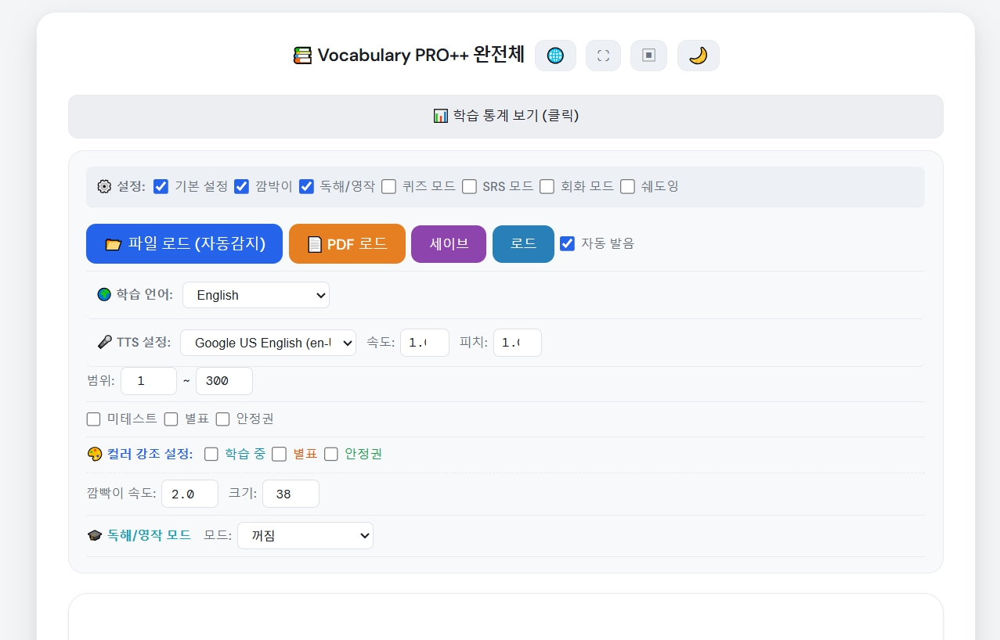
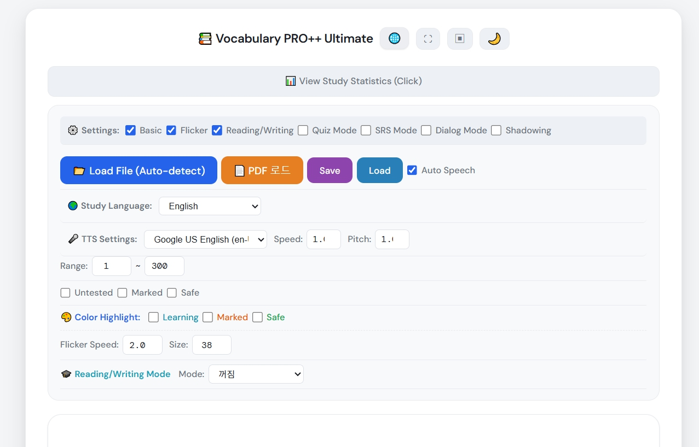
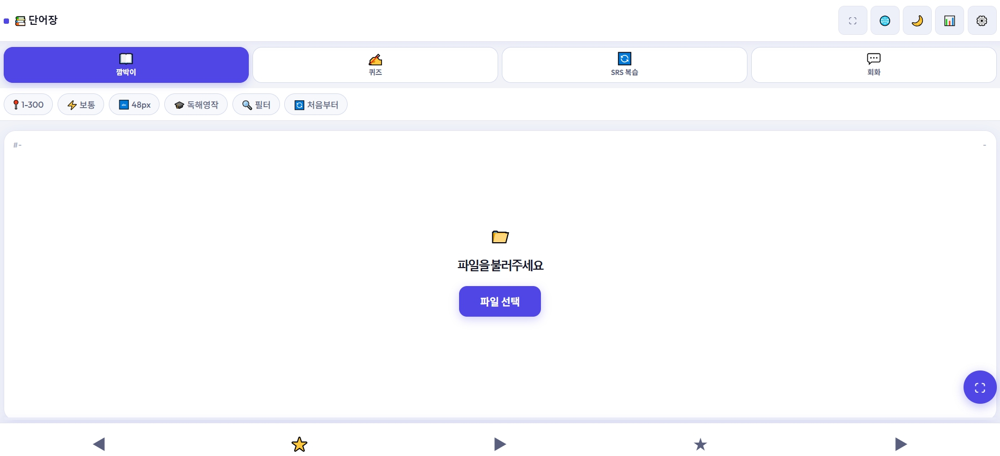
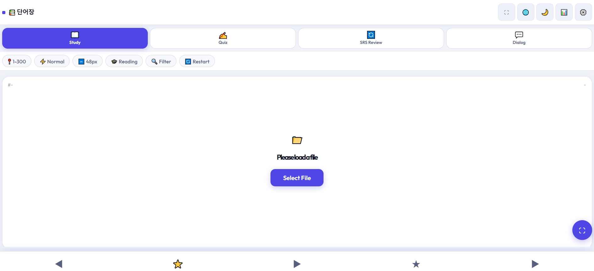
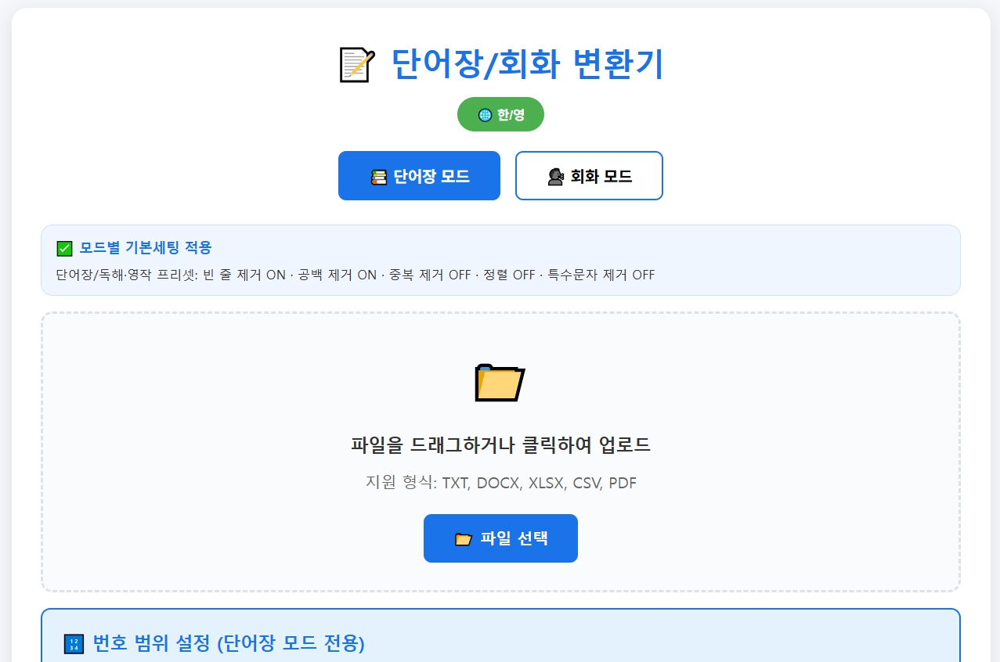
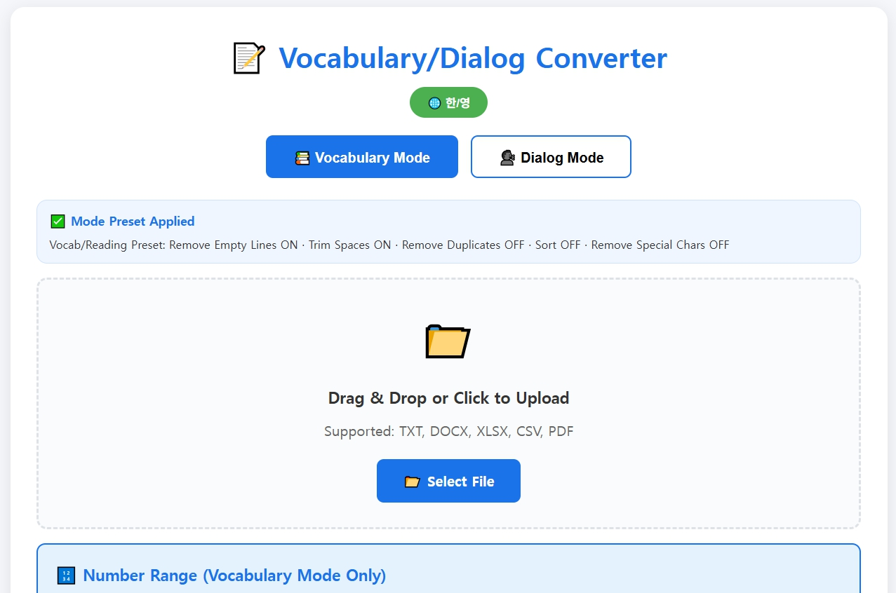

# 📚 Vocabulary PRO++# 📱 Vocabulary PRO++ Mobile

**모바일 특화 어휘·회화 학습 앱 · Mobile-first vocabulary & conversation study app**

[](https://lightborn77-gif.github.io/Mobile-word-sentence/)
[](LICENSE)

> 서버 없이 브라우저만으로 동작하는 완전 오프라인 단어 학습 도구  
> A fully offline vocabulary learning tool — runs entirely in the browser, no server needed.

---

## 📸 스크린샷 · Screenshots

*(스크린샷을 여기에 추가하세요 · Add screenshots here)*

---

## 🌟 주요 특징 · Key Features

- 📱 **모바일 최적화 UI** — 스와이프 제스처, 터치 친화적 레이아웃
- 🌐 **11개 학습 언어 + UI 한/영 전환** 지원
- 💾 **IndexedDB 기반 영구 저장** — 앱 종료 후에도 학습 데이터 유지
- 🔒 **화면 꺼짐 방지 (Wake Lock)** — 자동 재생 중 화면이 꺼지지 않음
- 📄 **PDF 단어장 자동 파싱** — 표 구조 PDF를 자동으로 단어장으로 변환
- 🎓 **독해/영작 모드** — 단어↔뜻 방향 반전 학습
- 🔄 **SRS 망각곡선 알고리즘** — 과학적 간격반복 복습

---

## 🌐 지원 언어 · Supported Study Languages

| | 언어 / Language | TTS 코드 |
|---|---|---|
| 🇺🇸 | English | en-US |
| 🇯🇵 | 日本語 | ja-JP |
| 🇨🇳 | 中文 | zh-CN |
| 🇪🇸 | Español | es-ES |
| 🇩🇪 | Deutsch | de-DE |
| 🇫🇷 | Français | fr-FR |
| 🇮🇹 | Italiano | it-IT |
| 🇵🇹 | Português | pt-PT |
| 🇷🇺 | Русский | ru-RU |
| 🇸🇦 | العربية | ar-SA |
| 🇮🇳 | हिन्दी | hi-IN |

> UI 자체도 **한국어 ↔ 영어** 전환 가능 · UI language toggles between **Korean ↔ English**

---

## 🚀 실행 방법 · How to Run

```
index.html을 스마트폰 브라우저(Chrome / Safari)로 열거나,
아래 링크에서 바로 실행하세요.

Open index.html in a smartphone browser (Chrome / Safari),
or launch directly from the link below.
```

▶ **[https://lightborn77-gif.github.io/Mobile-word-sentence/](https://lightborn77-gif.github.io/Mobile-word-sentence/)**

1. **파일 선택** 버튼으로 단어장 TXT 또는 PDF 업로드  
   Tap **Select File** to upload a vocabulary TXT or PDF
2. 상단 탭에서 학습 모드 선택  
   Select a study mode from the top tabs
3. ▶ 버튼으로 시작  
   Tap ▶ to start

---

## 🎯 학습 모드 상세 · Study Modes

### 1. 📖 깜박이 모드 · Flicker / Study Mode

단어를 자동으로 순서대로 넘기며 학습하는 기본 모드입니다.  
The core mode that automatically cycles through vocabulary cards.

| 기능 | 설명 |
|---|---|
| 자동 TTS 발음 | 선택한 학습 언어로 단어를 자동 낭독 |
| 속도 조절 | 빠름 / 보통 / 느림 (초 단위 설정) |
| 글자 크기 | 32px ~ 72px 자유 조절 |
| 독해/영작 모드 | 단어↔뜻 방향 반전, 생각 시간 설정 |
| 필터 | 미테스트 / 별표 / 안정권 단어만 선택 |
| 컬러 강조 | 학습중 / 별표 / 안정권 단어를 색상으로 구분 |
| 처음부터 | 현재 풀을 처음 번호부터 재시작 |

**제스처 (모바일) · Gestures (Mobile)**

| 동작 | 결과 |
|---|---|
| 카드 탭 | 뜻 표시 / 다음 단어 |
| 더블 탭 | 암기 완료(✓) 토글 |
| 스와이프 → | 이전 단어 |
| 스와이프 ← | 다음 단어 |
| 롱프레스 (풀스크린) | 모드 전환 바 표시 |

---

### 2. ✍️ 퀴즈 모드 · Quiz Mode

단어를 보고 뜻을 직접 입력하는 주관식 퀴즈입니다.  
An open-answer quiz where you type the meaning from memory.

| 기능 | 설명 |
|---|---|
| 문제 수 | 5 ~ 제한없음 (5 단위 조절) |
| 퀴즈 방향 | 앞→뒤 / 뒤→앞 / 섞기 |
| 힌트 | 첫 글자 힌트 표시 옵션 |
| 셔플 | 랜덤 출제 |
| 오답 지연 | 오답 후 정답 표시 시간 설정 |
| 별표 복습 | 오답 누적 단어 우선 출제 |
| 오답 부활 | 최근 N일 내 틀린 단어 자동 추가 |
| 퀴즈 리포트 | 정답률, 오답 목록, 회차별 통계 |

---

### 3. 🔄 SRS 복습 모드 · SRS Review Mode

**망각 곡선 기반 간격 반복 학습** — 과학적으로 설계된 복습 스케줄  
**Spaced Repetition based on the forgetting curve** — scientifically optimized review schedule

| 항목 | 내용 |
|---|---|
| 정답 시 | `interval = round(interval × easeFactor)` — 기본 2.5 |
| 오답 시 | `interval = round(interval × lapseRate)` — 기본 0 → 1일 리셋 |
| 안정권 조건 | 연속 정답 ≥ 5 AND 누적 정답 ≥ 10 |
| 복습 대상 | `lastSeen + interval ≤ today` |
| Hard Only | 별표 ≥ 3이고 안정권 아닌 단어만 |

---

### 4. 💬 회화 모드 · Dialog Mode

A/B 역할 대화문으로 회화를 학습합니다.  
Role-based A/B conversation study with TTS playback.

| 기능 | 설명 |
|---|---|
| 자동/수동 진행 | 자동(속도 설정) 또는 수동(탭으로 넘김) |
| 화자 전환 | A/B 역할 바꾸기 |
| TTS 낭독 | 컴퓨터 역할 대사 자동 낭독 |
| 쉐도잉 서브모드 | 따라 말하기 연습 (회화 모드 내 옵션) |

---

## 📁 파일 구조 · File Structure

```
ws_output/
├── index.html                  # 앱 진입점 · App entry point
├── css/
│   └── styles.css              # 모바일 최적화 스타일 (821줄)
│                               # Mobile-optimized styles (821 lines)
└── js/
    ├── app_state.js            # 전역 상태 관리 (State 패턴)
    │                           # Global state management (State pattern)
    ├── storage.js              # IndexedDB 저장소 (localStorage 호환 API)
    │                           # IndexedDB storage (localStorage-compatible API)
    ├── data_unified.js         # 데이터 파싱·검증·저장 통합 모듈
    │                           # Unified data parsing, validation & storage
    ├── engine.js               # 엔진 코어 (타이머·TTS·디스패처)
    │                           # Engine core (timer, TTS, dispatcher)
    ├── engine_mode.js          # 모드 전환 로직
    │                           # Mode switching logic
    ├── engine_run.js           # 재생·정지·다음·이전 흐름
    │                           # Play/stop/next/prev flow
    ├── engine_nav.js           # 네비게이션 (이전/다음 단어)
    │                           # Navigation (prev/next word)
    ├── engine_flags.js         # 별표·암기 플래그 처리
    │                           # Star & memorize flag handling
    ├── engine_restart_quiz.js  # 퀴즈 재시작 로직
    │                           # Quiz restart logic
    ├── quiz.js                 # 퀴즈 엔진 (출제·채점·리포트)
    │                           # Quiz engine (generate, grade, report)
    ├── srs.js                  # SRS 망각곡선 알고리즘
    │                           # SRS spaced repetition algorithm
    ├── dialog_flow.js          # 회화 진행 흐름
    │                           # Dialog playback flow
    ├── dialog_controls.js      # 회화 컨트롤 UI
    │                           # Dialog control UI
    ├── dialog_state.js         # 회화 상태 관리
    │                           # Dialog state management
    ├── tts_playback.js         # TTS 재생 (Web Speech API)
    │                           # TTS playback (Web Speech API)
    ├── tts_voices.js           # 음성 목록 로드·선택
    │                           # Voice list loading & selection
    ├── i18n_data.js            # 다국어 UI 텍스트·언어 설정
    │                           # Multilingual UI text & language config
    ├── i18n_tts.js             # TTS 언어 매핑
    │                           # TTS language mapping
    ├── pdf_loader.js           # PDF 좌표 클러스터링 파서
    │                           # PDF coordinate-clustering parser
    ├── render_stats.js         # 화면 렌더링·통계·리포트
    │                           # Screen rendering, stats & report
    ├── reading_playback.js     # 독해/영작 모드 재생
    │                           # Reading/writing mode playback
    ├── fullscreen_toggle.js    # 풀스크린 전환
    │                           # Fullscreen toggle
    ├── fullscreen_gestures.js  # 터치 제스처 (스와이프·더블탭·롱프레스)
    │                           # Touch gestures (swipe, double-tap, long-press)
    ├── fullscreen_modebar.js   # 풀스크린 모드바 UI
    │                           # Fullscreen modebar UI
    ├── shadow_loop_fab.js      # 쉐도잉 반복 플로팅 버튼
    │                           # Shadowing loop floating action button
    ├── theme.js                # 다크/라이트 테마
    │                           # Dark/light theme
    ├── wake_lock.js            # 화면 꺼짐 방지 (Wake Lock API)
    │                           # Screen wake lock (Wake Lock API)
    ├── ui_bindings.js          # UI 이벤트 바인딩
    │                           # UI event bindings
    ├── ui_handlers.js          # UI 이벤트 핸들러
    │                           # UI event handlers
    ├── ui_render.js            # UI 렌더링 유틸
    │                           # UI rendering utilities
    └── compat_shim.js          # 구버전 브라우저 호환 패치
                                # Legacy browser compatibility shim
```

---

## 🏗️ 아키텍처 · Architecture

```
┌─────────────────────────────────────────────────────────┐
│                     index.html (UI)                     │
│   Header / Mode Tabs / Control Bar / Card / Popups     │
└────────────────────┬────────────────────────────────────┘
                     │
         ┌───────────▼───────────┐
         │      App.State        │  ← 전역 상태 단일 진실 공급원
         │  (app_state.js)       │     Single source of truth
         └───────┬───────────────┘
                 │
    ┌────────────▼─────────────────────────────────┐
    │               Engine Layer                   │
    │  engine.js / engine_mode.js / engine_run.js  │
    │  → 타이머 관리 · TTS 디스패치 · 모드 전환     │
    └──┬──────────┬──────────┬────────────┬────────┘
       │          │          │            │
  ┌────▼──┐  ┌───▼──┐  ┌───▼──┐  ┌─────▼──┐
  │quiz.js│  │srs.js│  │dialog│  │reading │
  │퀴즈   │  │SRS   │  │회화  │  │독해/영작│
  └───────┘  └──────┘  └──────┘  └────────┘
       │
  ┌────▼──────────────────────────────────────┐
  │            Data Layer                     │
  │  data_unified.js → 파싱·검증·저장         │
  │  storage.js → IndexedDB (localStorage API)│
  │  pdf_loader.js → PDF 파싱                 │
  └───────────────────────────────────────────┘
```

---

## 💾 데이터 저장 · Data Storage

서버 없이 **브라우저 IndexedDB**에 자동 저장됩니다. localStorage보다 용량이 크고 안정적입니다.  
Auto-saved to **browser IndexedDB** — more stable and spacious than localStorage.

```
DB명 / DB Name: vocabMobileDB
저장 키 / Key:  mem_{파일명 / filename}

저장 필드 / Saved Fields:
  n              번호 / Word number
  m              암기 완료 여부 / Memorized flag
  w              별표 횟수(오답 누적) / Wrong count (star count)
  lastSeen       마지막 학습일 / Last studied date (YYYY-MM-DD)
  interval       다음 복습까지 일수 / Days until next review
  wrongDates     오답 발생 날짜 배열 / Wrong date history array
  quizCount      퀴즈 출제 횟수 / Total quiz appearances
  correctStreak  연속 정답 횟수 / Current correct streak
  totalCorrect   누적 총 정답 횟수 / Total correct count
  isSafe         안정권 여부 / Mastered (safe) flag
```

> 같은 파일명으로 재로드 시 이전 학습 데이터 자동 복원  
> Reload same filename → previous progress auto-restored

---

## 📝 입력 파일 형식 · Input File Formats

### 단어장 TXT · Vocabulary TXT

**2줄 쌍 형식 (권장) · 2-line pair format (Recommended)**

```
1. apple
1. 사과
2. banana
2. 바나나
```

**파싱 규칙 · Parsing Rules**
- `^\d+` + 구분자(`. - 공백`) 이후 텍스트 추출
- 알파벳 only → `word` 필드 / 한글·비알파벳 → `meaning` 필드
- 괄호 `()` 내 텍스트, 이모지(✅🟢❌) 자동 제거
- 같은 번호에 여러 뜻 → 쉼표 병합

### 회화 TXT · Dialog TXT

```
A: How are you?
잘 지내고 있어요?
B: I'm doing great, thanks!
정말 잘 지내고 있어요, 감사합니다!
```

- `A:` / `B:` 접두사 → 외국어 대사
- 바로 다음 줄 → 번역 (없어도 됨)

### PDF 형식 · PDF Format

표(Table) 구조를 자동 파싱합니다. Y좌표 클러스터링으로 행을 감지하고, 페이지 중앙 기준으로 단어/뜻을 분리합니다.  
Auto-parses table structure using Y-coordinate clustering to detect rows and split word/meaning by page midpoint.

```
| 번호 | 단어      | 뜻       |
|  1  | apple     | 사과      |
|  2  | beautiful | 아름다운   |
```

> ⚠️ 이미지 PDF(스캔본)는 지원하지 않습니다 · Scanned/image PDFs are not supported

---

## ⚙️ 시스템 요구사항 · Requirements

| | |
|---|---|
| **브라우저 / Browser** | Chrome 90+, Edge 90+, Safari 15+, Firefox 88+ |
| **TTS 권장 / TTS Recommended** | Edge — 11개 언어 다국어 TTS 지원 가장 안정적 |
| **인터넷 / Internet** | PDF 로드 시 PDF.js CDN 최초 1회만 필요 |
| **서버 / Server** | 불필요 · Not required — runs fully local |

---

## 📄 라이선스 · License

[LICENSE](LICENSE) 참조 · See LICENSE file

**이 소프트웨어는 CC BY-NC 4.0 라이선스로 배포됩니다.**  
**This software is distributed under the CC BY-NC 4.0 license.**

✅ 허용 / Allowed:
- 개인 학습 목적 사용
- 소스 코드 수정 및 개조
- 학교·학원·스터디 그룹 등 비영리 교육 목적 배포
- 출처 표기 후 재배포 (GitHub URL 또는 저작자 명시)
- 포트폴리오·학습 프로젝트에 활용

❌ 불허 / Not Allowed:
- 유료 판매 또는 상업적 서비스에 포함하여 수익 창출
- 저작권 고지 제거 후 자신의 저작물로 발표

---

## 🙏 피드백 · Feedback

이슈 또는 PR로 의견을 남겨주세요.  
더 많은 언어 학습자들에게 도움이 되도록 함께 발전시켜 나가고 싶습니다.

Issues and PRs are welcome.  
Let's make this useful for learners of every language together.


<p align="center">
  <b>Memorized 2,000 words in 18 days — 40 min/day, no carryover.</b><br/>
  A free, offline-ready vocab &amp; conversation study tool for any language.
</p>

<p align="center">
  <a href="https://lightborn77-gif.github.io/Mobile-word-sentence/">
    
  </a>
  &nbsp;
  <a href="https://lightborn77-gif.github.io/pc-word-sentence/">
    
  </a>
</p>

<p align="center">
  
  
</p>

---

> This tool was originally built for personal English study — reading original texts and preparing for exams.  
> The method behind it led to **memorizing 2,000 words at 99% retention in 18 days, 40 min/day with zero carryover**.  
> As it evolved, it became clear the structure works for any foreign language,  
> so it's now shared for learners of Japanese, Chinese, Spanish, and beyond.

---

## 🌐 지원 언어 / Supported Study Languages

**11개 학습 언어 지원 · Supports 11 Study Languages**

| | 언어 / Language | TTS 코드 |
|---|---|---|
| 🇺🇸 | English | en-US |
| 🇯🇵 | 日本語 | ja-JP |
| 🇨🇳 | 中文 | zh-CN |
| 🇪🇸 | Español | es-ES |
| 🇩🇪 | Deutsch | de-DE |
| 🇫🇷 | Français | fr-FR |
| 🇮🇹 | Italiano | it-IT |
| 🇵🇹 | Português | pt-PT |
| 🇷🇺 | Русский | ru-RU |
| 🇸🇦 | العربية | ar-SA |
| 🇰🇷 | 한국어 | ko-KR |

> UI 자체도 **한국어 ↔ 영어** 전환 가능 · UI language toggles between **Korean ↔ English**

---

## 📁 구성 파일 / File Structure

| 파일 / File | 설명 / Description |
|---|---|
| `ws_pc_layout_960/` | **PC 버전** — `ws_pc_output/index.html` 실행 · **PC Version** |
| `ws_mobile_redesign_i18n_fixed/` | **모바일 버전** — `ws_output/index.html` 실행 · **Mobile Version** |
| `logicmaker_plusPDF.html` | **로직메이커(변환기)** — 단어장·회화 파일을 앱 형식으로 변환 · **Converter** |
| `FORMAT_GUIDE.txt` | 텍스트 파일 작성 규칙 전체 가이드 · Full text format reference |
| `LICENSE` | 비상업적 자유 사용 라이선스 · Non-commercial free use license |

---

## 📸 스크린샷 / Screenshots

### 모바일 버전 · Mobile Version
<p>
  
  
</p>

### 로직메이커(변환기) · Logic Maker (Converter)
<p>
  
  
</p>

---

## 🚀 실행 방법 / How to Run

### PC 버전 · PC Version
1. `ws_pc_layout_960/ws_pc_output/index.html`을 Chrome / Edge로 열기  
   Open `ws_pc_layout_960/ws_pc_output/index.html` in Chrome or Edge
2. **파일 로드 (자동감지)** 버튼으로 단어장 TXT 또는 PDF 업로드  
   Click **Load File (Auto-detect)** to upload a vocabulary TXT or PDF
3. 깜박이 / 퀴즈 / SRS / 회화 / 쉐도잉 모드 선택 후 학습 시작  
   Select a study mode: Flicker / Quiz / SRS / Dialog / Shadowing

### 모바일 버전 · Mobile Version
1. `ws_mobile_redesign_i18n_fixed/ws_output/index.html`을 스마트폰 브라우저로 열기  
   Open `index.html` on a smartphone browser (Chrome / Safari)
2. 상단 탭 선택: 깜박이(Study) / 퀴즈(Quiz) / SRS 복습 / 회화(Dialog)  
   Select a tab: Study / Quiz / SRS Review / Dialog
3. **파일 선택** 버튼으로 단어장 업로드  
   Tap **Select File** to load your vocabulary file

### 로직메이커 · Logic Maker (Converter)
1. `logicmaker_plusPDF.html`을 브라우저로 열기 · Open in a browser
2. **단어장 모드** 또는 **회화 모드** 선택 · Select Vocabulary or Dialog Mode
3. TXT / DOCX / XLSX / CSV / PDF 파일 업로드 · Upload your file
4. 변환 옵션 설정 → **변환하기** 클릭 → 다운로드  
   Set options → Click **Convert** → Download

---

## 🔄 자료 준비 → 학습까지 전체 플로우 / Full Workflow: Prep to Study

```
┌───────────────────────────────────────────────────────────────────┐
│  📥  원본 자료 준비 / Prepare Source Material                       │
│                                                                   │
│  교재 PDF / 엑셀 / DOCX / CSV / 직접 작성 TXT                      │
│  Textbook PDF / Excel / DOCX / CSV / Handwritten TXT              │
└──────────────────────────────┬────────────────────────────────────┘
                               │
                               ▼
┌───────────────────────────────────────────────────────────────────┐
│  🤖  AI로 스크립트 다듬기 (선택) / Refine with AI (Optional)         │
│                                                                   │
│  ChatGPT / Claude 등에 프롬프트 / Prompt:                          │
│                                                                   │
│  [단어장] "아래 단어 목록을 다음 형식으로 변환해줘:                    │
│           번호. 영어단어 / 번호. 한국어뜻  (2줄씩 쌍으로)"            │
│  [Vocab]  "Convert this list to:                                  │
│           num. English / num. Korean  (2-line pairs)"             │
│                                                                   │
│  [회화]   "A: [영어 대사] / [한국어 번역] 형식으로 정리해줘"           │
│  [Dialog] "Format as: A: [English] / [Korean translation]"        │
└──────────────────────────────┬────────────────────────────────────┘
                               │
                               ▼
┌───────────────────────────────────────────────────────────────────┐
│  🔧  로직메이커로 파일 정제 / Refine with Logic Maker                │
│                                                                   │
│  logicmaker_plusPDF.html 열기 → 파일 업로드                         │
│  Open logicmaker_plusPDF.html → Upload file                       │
│                                                                   │
│  단어장 모드 프리셋 / Vocabulary preset:                            │
│    ✅ 빈 줄 제거 / Remove empty lines                              │
│    ✅ 공백 제거 / Trim spaces                                      │
│    ☑  중복 제거 / Remove duplicates  (선택 / optional)             │
│    ☑  번호 범위 지정 / Set number range  (선택 / optional)          │
│                                                                   │
│  회화 모드 프리셋 / Dialog preset:                                  │
│    ✅ 공백 제거 / Trim spaces                                      │
│    🔒 중복·정렬 자동 잠금 / Duplicate & Sort auto-locked OFF        │
│                                                                   │
│  → 미리보기 확인 → TXT 다운로드                                     │
│  → Preview → Download TXT                                        │
└──────────────────────────────┬────────────────────────────────────┘
                               │
                               ▼
┌───────────────────────────────────────────────────────────────────┐
│  📂  앱에 파일 로드 / Load File into App                            │
│                                                                   │
│  [파일 로드 (자동감지)] / [PDF 로드] 버튼 클릭                        │
│  Click "Load File (Auto-detect)" or "PDF Load"                    │
│                                                                   │
│  파일 형식 자동 감지 / Auto-Detection Logic:                        │
│    줄 앞 숫자 패턴 (^\\d+)  →  단어장 모드 / Vocabulary mode         │
│    A: / B: 패턴            →  회화 모드   / Dialog mode            │
└──────────────────────────────┬────────────────────────────────────┘
                               │
                               ▼
┌───────────────────────────────────────────────────────────────────┐
│  🎯  학습 모드 선택 / Choose Study Mode                             │
│                                                                   │
│   ① 깜박이 (Flicker/Study)    ② 퀴즈 (Quiz)                        │
│   ③ SRS 복습 (SRS Review)    ④ 회화 (Dialog)                      │
│   ⑤ 쉐도잉 (Shadowing) — PC 전용 / PC only                        │
└──────────────────────────────┬────────────────────────────────────┘
                               │
                               ▼
┌───────────────────────────────────────────────────────────────────┐
│  💾  진행 자동 저장 / Auto-Save Progress                            │
│                                                                   │
│  브라우저 localStorage에 파일명 키로 저장 (서버 불필요)                │
│  Saved to localStorage by filename key (no server needed)         │
│  같은 파일 재로드 시 이전 데이터 자동 복원                             │
│  Reload same filename → previous progress auto-restored           │
└───────────────────────────────────────────────────────────────────┘
```

---

## 🎯 주요 기능 / Features

### 1. 깜박이 모드 · Flicker / Study Mode
- 단어 표시 → 클릭/스페이스바로 뜻 확인 · Show word → reveal meaning on click/spacebar
- **TTS 자동 발음**: 선택한 학습 언어로 단어 자동 낭독 · Auto TTS in selected study language
- 음성 선택·속도·피치 조절 · Voice selection, speed & pitch control
- 독해/영작 모드: 뜻 → 단어 방향 반전 · Reading/Writing mode: flip direction
- 미암기 / 별표 / 안정권 필터 · Untested / Marked / Safe word filter
- 컬러 강조 표시: 학습 중 / 별표 / 안정권 색상 구분 · Color highlight by status

### 2. 퀴즈 모드 · Quiz Mode
- 단어를 보고 뜻을 직접 입력하는 주관식 · Open-answer quiz: type the meaning from memory
- 퀴즈 풀 구성 옵션 · Pool options:
  - 미테스트 우선 · Untested words first
  - 별표(오답 누적) 우선 · Marked (wrong history) first
  - 안정권 단어 포함 · Include Safe words
  - **부활 기능**: 최근 N일 내 틀린 단어 자동 추가 · **Revive**: auto-add words wrong within N days
- 채점 즉시 피드백, 오답 시 정답 표시 · Instant grading with correct answer revealed on wrong

### 3. SRS 복습 모드 · SRS Review Mode
**망각 곡선 기반 간격 반복 · Spaced Repetition based on the forgetting curve**

| 항목 / Item | 내용 / Detail |
|---|---|
| 정답 시 / Correct | `interval = round(interval × easeFactor)` — 기본 2.5 · default 2.5 |
| 오답 시 / Wrong | `interval = round(interval × lapseRate)` — 기본 0 = 1일 리셋 · default: reset to 1 |
| 안정권 조건 / Safe | 연속 정답 ≥ 5 AND 누적 정답 ≥ 10 · Streak ≥ 5 AND Total ≥ 10 |
| 복습 대상 / Due | `lastSeen + interval ≤ today` |
| Hard Only | 별표 ≥ 3 이고 isSafe = false · Words with w ≥ 3 and not safe |

### 4. 회화 모드 · Dialog Mode
- A/B 역할 대화문 학습 · A/B role-based conversation study
- 화자 전환(역할 바꾸기) · Speaker toggle (swap your role)
- TTS 자동 낭독 · Auto TTS playback per line

### 5. 쉐도잉 모드 · Shadowing Mode *(PC 버전 전용 · PC only)*
- TTS 재생과 함께 따라 말하기 · Shadow-speak along with TTS playback
- 자동 / 수동 진행 전환 · Auto / Manual advance
- 구간 반복 재생 · Segment loop repeat

### 6. 학습 통계 · Study Statistics
- 전체 / 암기 완료 / 별표 / 안정권 수 시각화 · Total / Memorized / Marked / Safe counts
- 날짜별 오답 기록 추적 · Wrong date history per word
- 퀴즈 정답률 통계 · Quiz accuracy stats

### 7. 다크 모드 / 전체화면 · Dark Mode / Fullscreen
- 라이트 ↔ 다크 테마 토글 · Light ↔ Dark theme toggle
- 전체화면 몰입 모드 · Immersive fullscreen
- 모바일: 스와이프 제스처 네비게이션 · Mobile: swipe gesture navigation

---

## 📝 입력 파일 형식 / Input File Formats

### 단어장 TXT · Vocabulary TXT

**방식 A · Method A — 2줄 쌍 (권장 · Recommended)**
```
1. apple
1. 사과
2. banana
2. 바나나
```

**방식 B · Method B — 일본어/중국어 등 비알파벳 외국어**
```
1. 食べる
1. 먹다
2. 走る
2. 달리다
```

**파싱 규칙 · Parsing Rules**
- `^\\d+` + 구분자(`. - 공백`) 이후 텍스트 추출 · Extract text after number + delimiter
- 알파벳 only → `word` 필드 / 한글·비알파벳 → `meaning` 필드
- 괄호 `()` 내 텍스트, 이모지(✅🟢❌) 자동 제거 · Auto-strip parentheses & emoji
- 같은 번호에 여러 뜻 → 쉼표 병합 · Multiple meanings on same number → comma-joined

### 회화 TXT · Dialog TXT
```
A: How are you?
잘 지내고 있어요?
B: I'm doing great, thanks!
정말 잘 지내고 있어요, 감사합니다!
```
- `A:` / `B:` 접두사 → 외국어 대사 · `A:/B:` prefix → foreign language line
- 바로 다음 줄 → 번역 (없어도 됨) · Next line → translation (optional)

### PDF 형식 · PDF Format
표(Table) 구조를 자동 파싱합니다 · Auto-parses table structure:
```
| 번호 | 단어       | 뜻        |
|  1  | apple      | 사과       |
|  2  | beautiful  | 아름다운    |
```
> 이미지 PDF(스캔본)는 지원하지 않습니다 · Scanned/image PDFs are not supported

---

## 💾 데이터 저장 / Data Storage

서버 없이 **브라우저 localStorage**에 자동 저장됩니다.  
Auto-saved to **browser localStorage** — no server required.

```
저장 키 / Key:   mem_{파일명 / filename}
저장 필드 / Fields:
  n              번호 / Word number
  m              암기 완료 여부 / Memorized flag
  w              별표 횟수(오답 누적) / Wrong count
  lastSeen       마지막 학습일 / Last studied (YYYY-MM-DD)
  interval       다음 복습까지 일수 / Days until next review
  wrongDates     오답 발생 날짜 배열 / Wrong date history array
  quizCount      퀴즈 출제 횟수 / Total quiz appearances
  correctStreak  연속 정답 횟수 / Current correct streak
  totalCorrect   누적 총 정답 횟수 / Total correct count
  isSafe         안정권 여부 / Mastered (safe) flag
```

> 같은 파일명으로 재로드 시 이전 학습 데이터 자동 복원  
> Reload same filename → previous progress auto-restored

---

## ⚙️ 시스템 요구사항 / Requirements

| | |
|---|---|
| **브라우저 / Browser** | Chrome 90+, Edge 90+, Safari 15+, Firefox 88+ — **다국어 TTS 지원은 Edge 권장 · Edge recommended for multilingual TTS** |
| **인터넷 / Internet** | PDF 로드 시 PDF.js CDN 최초 1회 · Required once for PDF loading |
| **서버 / Server** | 불필요 · Not required — runs fully local |
| **권장 브라우저 / Recommended** | Chrome·Edge 모두 정상 실행되나, **11개국 다국어 TTS는 Edge 실행을 권장합니다** · Both Chrome & Edge work, but **Edge is recommended for full multilingual TTS support** |
| **TTS** | 브라우저 내장 Web Speech API · Browser built-in Web Speech API |

---

## 📄 라이선스 / License

[LICENSE](LICENSE) 참조 · See LICENSE file

**비상업적 목적이라면 개인 사용·수정·재배포 모두 자유롭게 허용합니다.**  
**Free to use, modify, and redistribute for any non-commercial purpose.**  
CC BY-NC 4.0

---

## 🙏 피드백 / Feedback

이슈 또는 PR로 의견을 남겨주세요.  
더 많은 언어 학습자들에게 도움이 되도록 함께 발전시켜 나가고 싶습니다.

Issues and PRs are welcome.  
Let's make this useful for learners of every language together.
